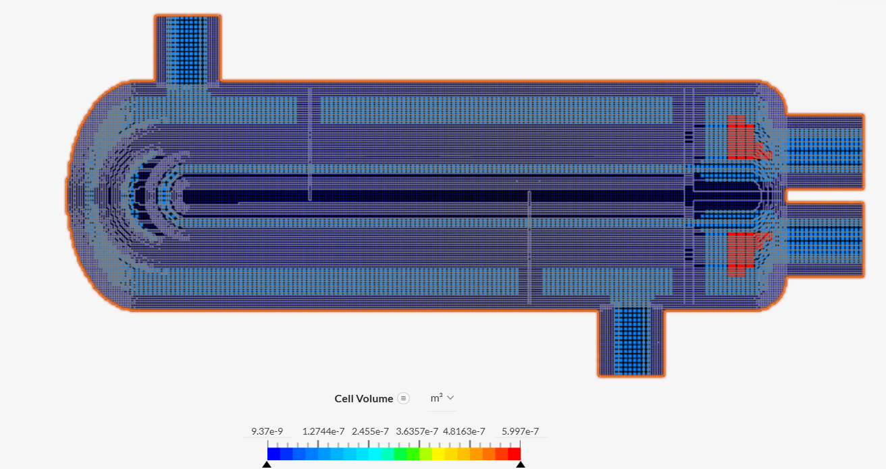
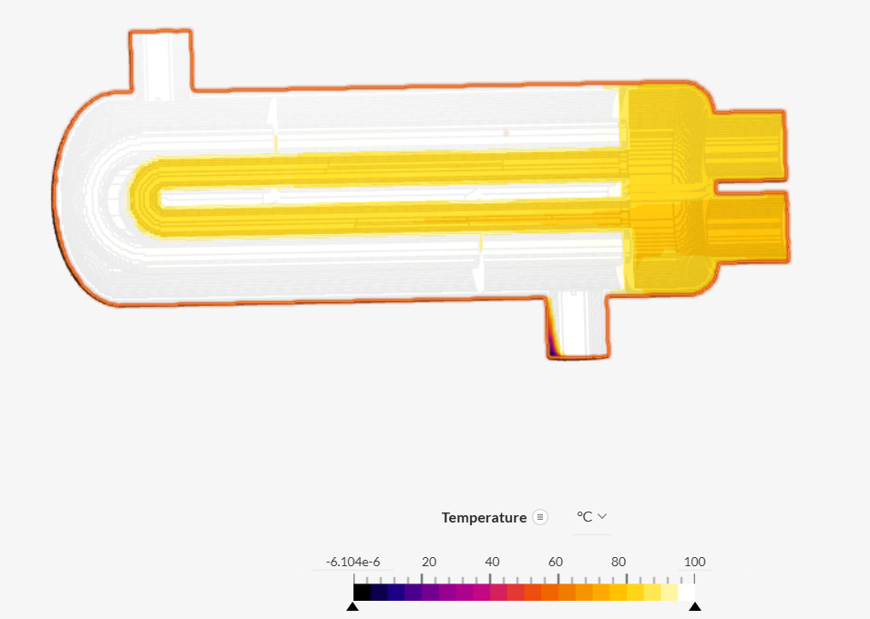
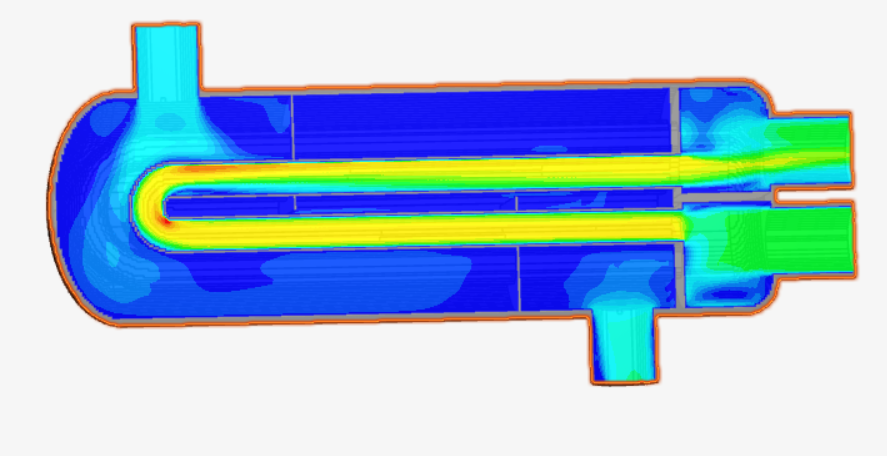
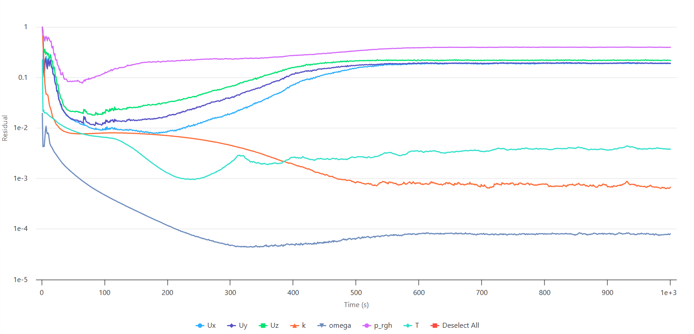

# U-Tube Heat Exchanger CFD Simulation — Conjugate Heat Transfer

## 1. Project Overview

This project presents a Computational Fluid Dynamics (CFD) study of a U-tube heat exchanger using SimScale.

A steady-state Conjugate Heat Transfer (CHT) analysis was performed to investigate the coupled flow and thermal behavior of the shell-side fluid, tube-side fluid, and solid heat-exchanger wall.

Water was used as the working fluid in both fluid regions, while steel was assigned to the solid heat-exchanger wall. The k–ω SST turbulence model was used to model turbulent flow.

The simulation workflow included geometry preparation, flow-volume creation, imprinting, material assignment, boundary-condition specification, mesh generation, simulation execution, and post-processing.

The project focuses on understanding the interaction between fluid flow and heat transfer in process equipment and developing practical CFD modeling skills.

---

## 2. Project Objectives

The main objectives of this study were to:

- Investigate temperature distribution within a U-tube heat exchanger.
- Analyze flow behavior in the shell-side and tube-side passages.
- Examine thermal interaction between the fluid regions and the solid heat-exchanger wall.
- Generate a computational mesh for CFD analysis.
- Visualize temperature and velocity distributions.
- Examine solver residuals and assess numerical convergence.
- Develop practical experience in CFD-based thermal analysis of process equipment.

---

## 3. Simulation Setup

| Parameter | Value |
|---|---|
| **Software** | SimScale |
| **Equipment** | U-tube heat exchanger |
| **Analysis Type** | Conjugate Heat Transfer (CHT) |
| **Analysis Approach** | Steady-state |
| **Turbulence Model** | k–ω SST |
| **Working Fluid** | Water |
| **Solid Material** | Steel |
| **Fluid Regions** | Shell-side and tube-side |
| **Simulation End Time** | 1,000 s |
| **Geometry Preparation** | Flow-volume extraction and imprint |
| **Mesh Generation** | SimScale meshing workflow |

The simulation was configured as a steady-state CHT analysis and was run to the specified simulation end time of 1,000 s.

---

## 4. Geometry Preparation

The computational model represents a U-tube heat exchanger containing separate shell-side and tube-side fluid regions and a solid heat-exchanger wall.

The geometry-preparation workflow included:

1. Importing the heat-exchanger geometry into SimScale.
2. Creating the shell-side and tube-side flow regions.
3. Preparing the fluid and solid domains for conjugate heat transfer.
4. Applying the imprint operation to the relevant bodies.
5. Saving the prepared geometry for meshing and simulation.

Accurate definition of the fluid and solid domains is important for representing both the flow fields and the thermal interaction between the fluids and the heat-exchanger wall.

---

## 5. Material Assignment

| Region | Material |
|---|---|
| **Shell-side fluid** | Water |
| **Tube-side fluid** | Water |
| **Solid heat-exchanger wall** | Steel |

Water was assigned to both fluid regions, while steel was assigned to the solid heat-exchanger wall.

These material definitions provide the physical properties required for the flow and heat-transfer calculations. The exact temperature-dependent properties depend on the material definitions selected in SimScale.

---

## 6. Boundary Conditions

The principal boundary conditions used in the simulation are summarized below.

| Parameter | Shell Side | Tube Side |
|---|---|---|
| **Inlet Temperature** | 100 °C | 80 °C |
| **Inlet Velocity** | −0.5 m/s | −0.8 m/s |
| **Outlet Condition** | Pressure outlet | Pressure outlet |
| **Working Fluid** | Water | Water |

### Boundary-Condition Notes

- The shell-side inlet temperature was set to **100 °C**.
- The tube-side inlet temperature was set to **80 °C**.
- The inlet velocities were specified as **−0.5 m/s** and **−0.8 m/s**.
- The negative signs were intentionally used to define the desired flow directions according to the selected coordinate system and boundary-face orientation.
- Pressure-outlet conditions were applied at the corresponding outlets.
- An additional temperature condition of **15 °C** was specified in the simulation setup.
- The fluid–solid interfaces were defined to allow conjugate heat transfer between the water regions and the steel heat-exchanger wall.

---

## 7. Mesh Generation

A computational mesh was generated in SimScale after preparation of the fluid and solid domains.

The mesh discretizes the computational domain into cells used by the numerical solver to calculate the flow and thermal fields.

Mesh resolution and quality can influence the prediction of:

- Velocity gradients
- Temperature gradients
- Thermal boundary layers
- Near-wall flow behavior
- Heat transfer between the fluid and solid regions

### Mesh Visualization

The mesh cell count, element-size distribution, and mesh-quality metrics can be added from the SimScale mesh statistics when available.

---

## 8. Simulation Execution

Following geometry preparation, material assignment, boundary-condition specification, and mesh generation, the steady-state CHT simulation was executed in SimScale.

The specified simulation end time was **1,000 seconds**.

After completion of the simulation, the temperature field, velocity field, and solver residual histories were examined during post-processing.

---

## 9. Results and Post-Processing

### 9.1 Temperature Distribution

The temperature contour shows the computed thermal field across the shell-side fluid, tube-side fluid, and steel heat-exchanger wall.

The displayed temperature range is approximately **19.85–100 °C**.

The temperature gradients provide qualitative insight into the thermal interaction between the fluid regions and the solid heat-exchanger wall.

The temperature field reflects the imposed thermal conditions, including the 100 °C shell-side inlet, 80 °C tube-side inlet, and the additional 15 °C temperature condition.

> **Note:** The displayed minimum and maximum temperatures should not be interpreted directly as the inlet and outlet temperatures of either fluid stream. Quantitative inlet and outlet temperatures should be extracted from the corresponding boundary surfaces.

---

### 9.2 Velocity Distribution

The velocity contour illustrates the flow distribution within the shell-side and tube-side passages.

Velocity variations can be examined to identify regions of flow acceleration, deceleration, and non-uniform flow development, particularly around changes in geometry and the U-tube bend.

The velocity field should be interpreted together with the prescribed inlet directions, outlet conditions, and geometry of the flow passages.

---

### 9.3 Solver Residuals

Solver residuals were monitored to examine the numerical behavior of the simulation.

The residual histories show an initial reduction in several variables, followed by leveling or variation in some residuals toward the end of the simulation.

The residual history provides an indication of numerical convergence behavior. However, residuals should be evaluated together with monitored engineering quantities to determine whether the steady-state solution is sufficiently converged.

---

## 10. Engineering Interpretation

The simulation provides qualitative insight into the coupled flow and thermal behavior of the U-tube heat exchanger.

The main areas investigated include:

- Temperature distribution within the shell-side and tube-side regions.
- Flow distribution through the heat-exchanger passages.
- Thermal interaction between the water regions and steel wall.
- Local velocity variations associated with the U-tube geometry.
- Numerical behavior of the solution during the simulation.

The temperature and velocity contours provide a visual representation of the computed flow and thermal fields.

At the current stage, the results are considered a preliminary CFD investigation. Quantitative heat-exchanger performance parameters have not been independently calculated from the available results.

---

## 11. Limitations and Recommended Improvements

The following steps would strengthen the reliability and engineering value of the simulation:

### 1. Assess Numerical Convergence

Evaluate the residual histories together with monitored temperatures, velocities, pressures, and other relevant quantities to determine whether the steady-state solution is sufficiently converged.

### 2. Evaluate Mesh Quality

Record the mesh cell count, mesh-quality metrics, and near-wall resolution where available.

### 3. Perform Mesh-Independence Testing

Compare key results obtained using different mesh resolutions to determine the sensitivity of the solution to mesh refinement.

### 4. Perform an Energy Balance

The heat transferred by each fluid stream can be estimated using:

\[
Q = \dot{m} C_p (T_{out}-T_{in})
\]

The heat lost by the hot stream should approximately correspond to the heat gained by the cold stream, subject to numerical error and any heat transfer through other boundaries.

This provides an important check on the thermal solution.

### 5. Calculate Heat-Exchanger Performance Metrics

Once the solution is sufficiently converged, additional engineering parameters can be calculated, including:

- Heat-transfer rate
- Pressure drop
- Overall heat-transfer coefficient
- Heat-exchanger effectiveness

### 6. Perform Additional Validation

Where possible, the CFD results can be compared with analytical calculations, established heat-transfer correlations, experimental data, or expected heat-exchanger behavior.

---

## 12. Conclusion

This project demonstrates a CFD workflow for investigating conjugate heat transfer in a U-tube heat exchanger using SimScale.

The study includes:

- Geometry preparation
- Flow-region creation
- Imprinting of fluid and solid regions
- Material assignment
- Boundary-condition specification
- Computational mesh generation
- Steady-state CHT simulation
- Temperature and velocity post-processing
- Solver residual analysis

The resulting temperature and velocity fields provide qualitative insight into the coupled thermal and flow behavior of the heat exchanger.

The simulation also provided practical experience in setting up and interpreting a CHT model for process equipment. Further convergence assessment, mesh-independence testing, energy-balance verification, and extraction of quantitative heat-exchanger performance parameters would strengthen the engineering validity of the results.

---

## 13. Simulation Project

**SimScale Project:**  
https://www.simscale.com/projects/mehwish_akhtar/heat_transfer_in_a_u-tube_heat_exchanger_1425350692/

